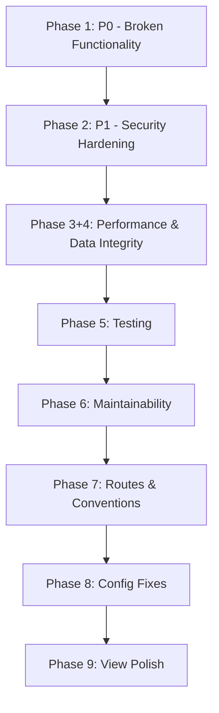

# Remediation Plan — Codebase-Wide Issues

**Date:** July 29, 2026
**Source:** Comprehensive codebase review (big-pickle)
**Total Issues:** 72 (3 Critical, 39 High, 18 Medium, 12 Low)
**Estimated Effort:** ~40-50 hours

---

## Priority Legend

| Tag | Meaning |
|-----|---------|
| 🔴 **P0** | Must fix immediately — breaks functionality or is a security hole |
| 🟠 **P1** | High impact — security, data integrity, or major performance |
| 🟡 **P2** | Medium impact — maintainability, code quality, minor bugs |
| 🟢 **P3** | Low impact — nice-to-have, cosmetic, conventions |

---

## Phase 1: 🔴 P0 — Broken Functionality & Critical Security (3 items, ~3h)

### 1.1 Fix Broken Migration — `Schema::rename()` Used Incorrectly

| Field | Value |
|-------|-------|
| **File** | `database/migrations/2026_07_03_000002_fix_payed_to_paid.php` |
| **Issue** | `Schema::rename($table, 'payed', 'paid')` renames **tables**, not columns. This migration throws an error when run. |
| **Fix** | Replace with `Schema::table($table, function (Blueprint $t) { $t->renameColumn('payed', 'paid'); })` |
| **Risk** | Blocks all future migrations from running. |
| **Estimate** | 15 min |

### 1.2 Add Missing Indexes on Polymorphic Columns

| Field | Value |
|-------|-------|
| **Files** | `database/migrations/2026_06_05_213142_create_inventory_order_items_table.php`, `2026_07_24_000001_fix_inventory_indexes_and_reference_id_type.php` |
| **Issue** | `inventory_order_items` has no indexes on `itemable_id`, `itemable_type`. No composite polymorphic index. Every lookup scans the table. |
| **Fix** | Create a new migration adding `->index('itemable_type')`, `->index('itemable_id')`, and `->index(['itemable_type', 'itemable_id'])` to `inventory_order_items`. Same for `inventory_transactions.reference_type` + `reference_id`. |
| **Estimate** | 30 min |

### 1.3 Destructive Artisan Commands Via GET Routes

| Field | Value |
|-------|-------|
| **File** | `routes/local.php` (via `routes/web.php` lines 73-75) |
| **Issue** | `/mif` runs `migrate:fresh --seed` (destructive), `/fake` creates factories/seeders, `/route` lists routes — all via GET. Guard uses `==` not `===`. |
| **Fix** | Change guard to `config('app.env') === 'local'` AND add IP whitelisting `$request->ip() === '127.0.0.1'`. Add comments warning future developers. |
| **Estimate** | 15 min |

---

## Phase 2: 🟠 P1 — Security Hardening (12 items, ~10h)

### 2.1 Escape LIKE Wildcard Characters

| Field | Value |
|-------|-------|
| **Files** | `InventoryItemController.php:43`, `InventoryOrderController.php:46-47`, `ActivityLogController.php:24` |
| **Issue** | `LIKE "%{$search}%"` — `%` and `_` wildcards not escaped. Enables DoS via `%%%%%%%%%` patterns. |
| **Fix** | Add `$search = str_replace(['%', '_'], ['\\%', '\\_'], $search)` before each LIKE query. |
| **Estimate** | 30 min |

### 2.2 Add Missing `$this->authorize()` Calls

| Field | Value |
|-------|-------|
| **Files** | `InventoryOrderController::pay()`, `InventoryGardController::store()`, `InventoryGardController::update()` |
| **Issue** | These methods rely solely on constructor middleware permissions but have no explicit policy check. |
| **Fix** | Add `$this->authorize('pay', InventoryOrder::class)` etc. for each method. |
| **Estimate** | 30 min |

### 2.3 Fix `env()` Call Outside Config

| Field | Value |
|-------|-------|
| **File** | `app/Console/Commands/MigrateMysqlToPostgres.php:73` |
| **Issue** | `env('MYSQL_OLD_DB')` returns `null` when config is cached. |
| **Fix** | Replace with `config('database.connections.mysql_old.database')` and add to `config/database.php`. |
| **Estimate** | 15 min |

### 2.4 Lock Down CORS Configuration

| Field | Value |
|-------|-------|
| **File** | `config/cors.php` |
| **Issue** | `allowed_origins => ['*']`, `allowed_methods => ['*']`, `allowed_headers => ['*']`. API open to any origin. |
| **Fix** | Restrict to specific origins via `env('CORS_ALLOWED_ORIGINS', '')` or the app URL. |
| **Estimate** | 15 min |

### 2.5 Harden Telescope Configuration

| Field | Value |
|-------|-------|
| **File** | `config/telescope.php:19,45` |
| **Issue** | Telescope enabled by default (`env('TELESCOPE_ENABLED', true)`). Default path is well-known `'telescope'`. |
| **Fix** | Change default to `env('TELESCOPE_ENABLED', false)` and randomize path via env. |
| **Estimate** | 10 min |

### 2.6 Fix Livewire Release Token

| Field | Value |
|-------|-------|
| **File** | `config/livewire.php:250` |
| **Issue** | `'release_token' => 'a'` — single character, zero security. |
| **Fix** | Change to `env('APP_KEY')` or a proper random string. |
| **Estimate** | 5 min |

### 2.7 Guard Against Null School Return

| Field | Value |
|-------|-------|
| **Files** | All controllers using `$this->getSchool()` from `SchoolTrait` |
| **Issue** | `getSchool()` returns `null` when `Auth::user()` has no school. None of ~20 callers check for null. |
| **Fix** | Add `abort(403, 'School not found')` in the trait when school is null OR add null checks in each controller. Better: fix at trait level. |
| **Estimate** | 1h |

### 2.8 Fix User Model Fillable Typo

| Field | Value |
|-------|-------|
| **File** | `app/Models/User.php:45` |
| **Issue** | `$fillable` has `'reiligon'` (typo) but `$casts` has `'religion'`. Filling `'religion'` silently fails. |
| **Fix** | Change `'reiligon'` → `'religion'` in `$fillable`. |
| **Estimate** | 5 min |

### 2.9 Harden Backup File Operations

| Field | Value |
|-------|-------|
| **File** | `BackupController.php:80,100` |
| **Issue** | No validation on `$file_name` — path traversal possible in download/delete. |
| **Fix** | Sanitize filename: `basename($file_name)`, validate against allowed chars, ensure path is within backup disk. |
| **Estimate** | 30 min |

### 2.10 Move Backup to Queue Job

| Field | Value |
|-------|-------|
| **File** | `BackupController.php:65` |
| **Issue** | `Artisan::call('backup:run')` runs synchronously in request. Blocks response for potentially minutes. |
| **Fix** | Dispatch to queue: `dispatch(new CreateBackupJob())`. Add rate limiting to prevent concurrent backups. |
| **Estimate** | 1h |

### 2.11 Fix CSP Headers

| Field | Value |
|-------|-------|
| **File** | `app/Http/Middleware/SecurityHeadersMiddleware.php` |
| **Issue** | CSP allows `unsafe-inline` + `unsafe-eval`. Missing `connect-src`, `font-src`, `frame-src`. |
| **Fix** | Remove `unsafe-eval`, add missing directives. Keep `unsafe-inline` for Livewire/Alpine.js compatibility. |
| **Estimate** | 30 min |

### 2.12 Apply SanitizeInput Middleware to Inventory Routes

| Field | Value |
|-------|-------|
| **File** | `routes/inventory.php` |
| **Issue** | `SanitizeInput` middleware strips HTML from `name`/`notes`/`description` fields but isn't applied to any inventory route. |
| **Fix** | Add `->middleware('sanitize')` to inventory route groups. |
| **Estimate** | 10 min |

---

## Phase 3: 🟠 P1 — Performance & N+1 Fixes (7 items, ~4h)

### 3.1 Add Missing Eager Loads

| # | File | Missing Eager Load | Fix |
|---|------|--------------------|-----|
| 1 | `InventoryOrderController.php:39-42` | `student`, `user` in `index()` | Add `->with(['student', 'user'])` |
| 2 | `InventoryItemController.php:34-40` | `classroom` in `index()` | Add `->with('classroom')` |
| 3 | `ReportController.php` | `grade`, `classroom` in popup views | Add eager loads in controller |
| 4 | PDF report views | `orders` relationship | Add eager loads in controller |
| **Estimate** | 1h |

### 3.2 Replace Unbounded Queries with Searchable Selects

| # | File | Query | Fix |
|---|------|-------|-----|
| 1 | `InventoryOrderController.php:79,98` | `Student::where('school_id', ...)->get()` — loads ALL students | Replace with server-side searchable select (Select2/TomSelect with AJAX) |
| 2 | `InventoryOrderController.php:95` | `InventoryItem::where(...)->active()->get()` — loads ALL items | Same: searchable paginated select |
| 3 | `InventoryGardController.php:26-28` | Same items query | Same |
| **Note** | With thousands of students/items, these dropdowns consume 10s+ MB per page load. | |
| **Estimate** | 3h |

### 3.3 Fix GardService Query-Within-Loop

| Field | Value |
|-------|-------|
| **File** | `InventoryGardService.php:43` |
| **Issue** | `InventoryItem::findOrFail($itemData['item_id'])` runs inside the `foreach` loop — N queries for N items. |
| **Fix** | Fetch all items before the loop: `$items = InventoryItem::whereIn('id', collect($data['items'])->pluck('item_id'))->get()->keyBy('id')`, then use the map inside the loop. |
| **Estimate** | 30 min |

---

## Phase 4: 🟠 P1 — Data Integrity (5 items, ~3h)

### 4.1 Fix Initial Orders Migration Enum

| Field | Value |
|-------|-------|
| **File** | `2026_06_05_212647_create_inventory_orders_table.php` + `2026_06_28_222252_fix_inventory_orders_enum_add_gard.php` |
| **Issue** | Initial enum has `['inventory', 'sales', 'purchases']` but no `'gard'`. Fix migration uses raw CHECK constraint SQL that may fail on MySQL 8.0.16+. |
| **Fix** | Rewrite the fix migration to use `ALTER TABLE ... MODIFY COLUMN type ENUM(...)` for MySQL compatibility. |
| **Estimate** | 30 min |

### 4.2 Fix Dynamic Tailwind Classes in Blade

| Field | Value |
|-------|-------|
| **File** | `orders/index.blade.php:131` |
| **Issue** | `text-{{ $order->status->value === 'paid' ? 'yellow' : 'green' }}-600` — JIT can't detect dynamically constructed class names. They won't exist in production CSS. |
| **Fix** | Replace with a full class string from a computed value or use `@php` to build the class: `@php($color = $order->status->value === 'paid' ? 'text-yellow-600' : 'text-green-600')` then use `{{ $color }}`. |
| **Estimate** | 15 min |

### 4.3 Fix Blade/Alpine Index Collision in Edit Forms

| Field | Value |
|-------|-------|
| **Files** | `edit_sarf.blade.php`, `edit_tawreed.blade.php` |
| **Issue** | Server-rendered items use `$loop->index`, Alpine-added items use incrementing counter. Indices collide on form submission. |
| **Fix** | Render all items via Alpine `x-for` (including existing ones). Pass initial items as JSON to `x-data`, then render both new and existing uniformly through Alpine. |
| **Estimate** | 1.5h |

### 4.4 Fix `_item_row.blade.php` — Show Correct Quantity Field Per Order Type

| Field | Value |
|-------|-------|
| **File** | `_item_row.blade.php` |
| **Issue** | Both `quantity_in` and `quantity_out` render for every row. For `sarf` (sales), only `quantity_out` should show. For `tawreed` (inventory), only `quantity_in`. |
| **Fix** | Pass an `$orderType` parameter to the partial and conditionally show/hide fields with `x-show`. |
| **Estimate** | 30 min |

### 4.5 Fix Classroom Select Default Value in `_form.blade.php`

| Field | Value |
|-------|-------|
| **File** | `_form.blade.php:42` |
| **Issue** | `old('classroom_id', $item->id ?? '')` uses `$item->id` instead of `$item->classroom_id`. Edit forms never pre-select the correct classroom. |
| **Fix** | Change to `$item->classroom_id`. |
| **Estimate** | 5 min |

---

## Phase 5: 🟠 P1 — Testing Gaps (7 items, ~8h)

| # | Missing Tests | Priority |
|---|---------------|----------|
| 1 | `InventoryGardController` — create, store, edit, update flows | High |
| 2 | `InventoryTransactionService` — stockIn, stockOut, adjustStock, canStockOut | High |
| 3 | Inventory order `update()` and `destroy()` endpoints | High |
| 4 | Inventory order `pay()` toggle method | High |
| 5 | Unauthorized access — permission enforcement on all inventory endpoints | High |
| 6 | School-scoping — user from school A cannot see school B's inventory data | High |
| 7 | Extract shared test setup into base class/trait (duplicated in `InventoryItemTest` and `InventoryOrderTest`) | Medium |

**Estimate:** 8h

---

## Phase 6: 🟡 P2 — Maintainability (12 items, ~12h)

### 6.1 Consolidate Permission Names

| Field | Value |
|-------|-------|
| **Scope** | All controllers, policies, form requests, `PermissionsHelper.php` |
| **Issue** | Legacy permission names (`stocks-*`, `clothes-*`, `books_sheets-*`) used throughout. Confusing and tightly coupled to old module structure. |
| **Fix** | Create unified permissions: `inventory.items.*`, `inventory.orders.*`. Add migration to rename permission records in DB. Update all references. This is a **big change** — needs careful testing. |
| **Estimate** | 4h |

### 6.2 Remove Duplicate Permission Logic

| Field | Value |
|-------|-------|
| **Issue** | Permission checks duplicated in 4 layers: middleware, form request `authorize()`, policy classes, controller `$this->authorize()`. |
| **Fix** | Standardize: use form request `authorize()` for input validation permissions, use policies for business logic authorization. Remove redundant middleware and controller checks where the form request or policy already covers them. |
| **Estimate** | 3h |

### 6.3 Clean Up Dead Code

| # | File | Issue | Action |
|---|------|-------|--------|
| 1 | `app/Models/ClassRoom2.php` | Duplicate model | Remove file |
| 2 | `app/Services/Reports/PDFExportService.php` | Dead service | Remove or merge with ReportService |
| 3 | `app/Services/Reports/ReportService.php` | Injected but never used in controllers | Remove or use properly |
| **Estimate** | 1h |

### 6.4 Extract Shared Validation Into Base Request

| Field | Value |
|-------|-------|
| **Files** | `StoreOrderRequest.php`, `UpdateOrderRequest.php` |
| **Issue** | Identical validation rules duplicated. |
| **Fix** | Create `BaseOrderRequest` with shared rules, extend in both. |
| **Estimate** | 30 min |

### 6.5 Fix Undefined `$order` in PDF Reports

| Field | Value |
|-------|-------|
| **Files** | `clothe_stock.blade.php:61`, `book_sheet_stock.blade.php:60`, `stock_product_view.blade.php:70` |
| **Issue** | `tfoot` references `$order['total']` from the `@forelse` loop. On empty result sets, `$order` is undefined → error. |
| **Fix** | Initialize `$order = ['total' => 0]` before the loop. |
| **Estimate** | 15 min |

### 6.6 Replace `@foreach` with `@forelse` Where Empty States Missing

| Files | Views |
|-------|-------|
| `orders/show.blade.php`, `PDF/clothes_stocks.blade.php`, `PDF/books_sheets_stocks.blade.php`, `PDF/stock_product.blade.php` |

**Estimate:** 15 min

### 6.7 Register Missing Policies in `AuthServiceProvider`

| Field | Value |
|-------|-------|
| **File** | `app/Providers/AuthServiceProvider.php` |
| **Issue** | `EmployeePolicy` is not registered (7 of 8 are). |
| **Fix** | Add mapping. |
| **Estimate** | 5 min |

### 6.8 Inconsistent Naming Fixes

| # | File | Current | Fix |
|---|------|---------|-----|
| 1 | Controller naming | `promotionController` | `PromotionController` |
| 2 | Controller naming | `fund_accountsController` | `FundAccountsController` |
| 3 | Controller naming | `schedulesController` | `SchedulesController` |
| **Estimate** | 30 min |

---

## Phase 7: 🟡 P2 — Route & Convention Cleanup (6 items, ~2h)

| # | Task | Details |
|---|------|---------|
| 1 | Move `/{type}` catch-all to end of orders route group | Prevents it from hijacking `/create`, `/show` etc. |
| 2 | Convert `POST /update` → `PUT /{id}` (13 occurrences across 6 route files) | REST convention + CSRF protection for updates |
| 3 | Convert snake_case URL segments → kebab-case (20+ occurrences) | URL convention |
| 4 | Add `->name()` to all API routes in `routes/api.php` | Consistency |
| 5 | Fix delete routes: `Route::get('/{id}/destroy')` → `Route::delete('/{id}')` | Security — GET requests bypass CSRF |
| 6 | Add `throttle` middleware to specific inventory endpoints | Rate limiting |

**Estimate:** 2h

---

## Phase 8: 🟡 P2 — Hardcoded Values & Config Fixes (6 items, ~1h)

| # | File | Current | Fix |
|---|------|---------|-----|
| 1 | `config/app.php:81` | `'timezone' => 'EET'` | `env('APP_TIMEZONE', 'EET')` |
| 2 | `config/app.php:94` | `'locale' => 'ar'` | `env('APP_LOCALE', 'ar')` |
| 3 | Multiple controllers | `'EGP'` hardcoded | `config('school.currency')` |
| 4 | Multiple controllers | `->paginate(10)` | `config('school.per_page')` |
| 5 | `header.blade.php:19` | Hardcoded Facebook URL | Config or env variable |
| 6 | `app.blade.php:98` | `'/login'` hardcoded | `route('login')` |

**Estimate:** 1h

---

## Phase 9: 🟢 P3 — View Polish (8 items, ~3h)

| # | Task | Files |
|---|------|-------|
| 1 | Replace hardcoded `'Sheet'` with `trans('book_sheet.sheet')` | `items/index.blade.php:56` |
| 2 | Replace hardcoded Arabic strings with `trans()` | `app.blade.php`, `header.blade.php`, `sidebar.blade.php`, `report_view.blade.php` |
| 3 | Add accessible labels to icons | `items/index.blade.php`, `_item_row.blade.php`, `items/show.blade.php` |
| 4 | Fix `checkAll()` JS function in roles | `roles/create.blade.php` |
| 5 | Add `required` attribute to student selects | `create_sarf.blade.php`, `edit_sarf.blade.php` |
| 6 | Remove commented-out code | `app.blade.php:59` |
| 7 | Fix duplicate CSS in `header_css.blade.php` | `header_css.blade.php` |
| 8 | Extract large PHP blocks from views to services | `report/index.blade.php`, `sidebar.blade.php` |

**Estimate:** 3h

---

## Execution Order



**Phases 2 and 3/4 can run partially in parallel** (different files, different developers).

Phases 6-9 are independent of each other and can be reordered based on priority.

---

## Verification

After each phase, run:

```bash
# Syntax & formatting
vendor/bin/pint --dirty --format agent

# Database integrity (if migrations changed)
php artisan migrate --pretend

# Affected tests
php artisan test --compact --filter=InventoryItemTest
php artisan test --compact --filter=InventoryOrderTest
php artisan test --compact --filter=RouteTest

# Routes
php artisan route:list --path=inventory

# Full suite once all phases done
php artisan test --compact
```

---

## Effort Summary

| Phase | Items | Hours | Category |
|-------|-------|-------|----------|
| 1: P0 — Broken | 3 | 3h | 🔴 Critical |
| 2: P1 — Security | 12 | 10h | 🟠 High |
| 3: P1 — Performance | 7 | 4h | 🟠 High |
| 4: P1 — Data Integrity | 5 | 3h | 🟠 High |
| 5: P1 — Testing Gaps | 7 | 8h | 🟠 High |
| 6: P2 — Maintainability | 12 | 12h | 🟡 Medium |
| 7: P2 — Routes | 6 | 2h | 🟡 Medium |
| 8: P2 — Config | 6 | 1h | 🟡 Medium |
| 9: P3 — View Polish | 8 | 3h | 🟢 Low |
| **Total** | **72** | **~46h** | |

---

## Quick Wins (Knock Out in a Day)

These are high-impact, low-effort items that can be fixed quickly:

1. **1.3** — Fix local routes guard (`==` → `===` + IP check) ~15min
2. **2.4** — Lock down CORS ~15min
3. **2.5** — Disable Telescope by default ~10min
4. **2.6** — Fix Livewire release token ~5min
5. **2.8** — Fix `reiligon` typo ~5min
6. **4.5** — Fix classroom select default ~5min
7. **6.5** — Fix undefined `$order` in PDF reports ~15min
8. **6.7** — Register EmployeePolicy ~5min
9. **8.3-8.6** — Config hardcoded values ~30min

**Total quick wins:** ~9 items, ~1.5h
