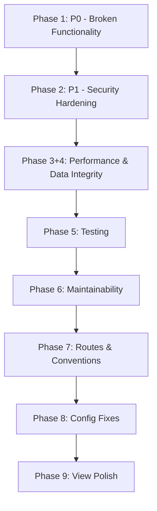

# Implementation Plan: Codebase Remediation

**Feature Branch**: `009-codebase-remediation`
**Created**: 2026-07-30
**Status**: Planning Complete

## Technical Context

- **Framework**: Laravel 10 + Livewire v4
- **PHP**: 8.5
- **Frontend**: Tailwind CSS v4, Alpine.js v3
- **Database**: MySQL/MariaDB (primary), SQLite (testing)
- **Testing**: PHPUnit v10
- **Auth**: Spatie Permissions
- **CSP**: Middleware-based security headers
- **Telescope**: Debug toolbar (dev only)
- **Backup**: Laravel backup package, currently synchronous
- **CORS**: Config-based cross-origin settings

All NEEDS CLARIFICATION markers have been resolved — the remediation plan (docs/remediation-plan.md) provides sufficient technical detail for every issue.

## Constitution Check

No constitution file found. Skipping constitution checks.

## Gates

| Gate | Status | Notes |
|------|--------|-------|
| All 9 phases have clear owner artifacts | ✅ | spec.md maps all FR-xxx to phases |
| Branch created | ✅ | `009-codebase-remediation` |
| No external API consumers | ✅ | Assumption verified — HTTP method changes (GET→DELETE, POST→PUT) are safe |
| Tailwind v4 dynamic class detection | ⚠️ | Must use full class strings, not concatenation — known constraint |
| Config cache safety | ✅ | `env()` only in config files, `config()` everywhere else |

## Files to Create/Modify

| # | File | Action | Purpose |
|---|------|--------|---------|
| **Phase 1: P0 — Broken Functionality** ||||
| 1 | `database/migrations/2026_07_03_000002_fix_payed_to_paid.php` | Modify | Fix `Schema::rename()` → `renameColumn()` |
| 2 | `database/migrations/2026_07_24_000001_fix_inventory_indexes_and_reference_id_type.php` | Modify | Add indexes on polymorphic columns |
| 3 | `routes/web.php` | Modify | Fix local routes guard (=== + IP whitelist) |
| **Phase 2: P1 — Security Hardening** ||||
| 4 | `app/Http/Controllers/Inventory/InventoryItemController.php` | Modify | Escape LIKE wildcards |
| 5 | `app/Http/Controllers/Inventory/InventoryOrderController.php` | Modify | Escape LIKE wildcards + add authorize() |
| 6 | `app/Http/Controllers/Inventory/InventoryGardController.php` | Modify | Add authorize() |
| 7 | `app/Http/Controllers/Admin/ActivityLogController.php` | Modify | Escape LIKE wildcards |
| 8 | `app/Console/Commands/MigrateMysqlToPostgres.php` | Modify | Replace `env()` with `config()` |
| 9 | `config/database.php` | Modify | Add `mysql_old` connection config |
| 10 | `config/cors.php` | Modify | Restrict allowed_origins |
| 11 | `config/telescope.php` | Modify | Default to disabled |
| 12 | `config/livewire.php` | Modify | Fix release_token |
| 13 | `app/Http/Traits/SchoolTrait.php` | Modify | Handle null getSchool() |
| 14 | `app/Models/User.php` | Modify | Fix 'reiligon' → 'religion' fillable |
| 15 | `app/Http/Controllers/BackupController.php` | Modify | Sanitize filenames |
| 16 | `app/Jobs/CreateBackupJob.php` | Create | Async backup job |
| 17 | `app/Http/Middleware/SecurityHeadersMiddleware.php` | Modify | Fix CSP directives |
| 18 | `routes/inventory.php` | Modify | Add sanitize middleware |
| **Phase 3: P1 — Performance & N+1** ||||
| 19 | `app/Http/Controllers/Inventory/InventoryOrderController.php` | Modify | Add eager loads |
| 20 | `app/Http/Controllers/Inventory/InventoryItemController.php` | Modify | Add eager loads |
| 21 | `app/Http/Controllers/ReportController.php` | Modify | Add eager loads for popup views |
| 22 | `app/Services/Inventory/InventoryGardService.php` | Modify | Batch-fetch items before loop |
| **Phase 4: P1 — Data Integrity** ||||
| 23 | `database/migrations/2026_06_28_222252_fix_inventory_orders_enum_add_gard.php` | Modify | Use ALTER TABLE MODIFY for MySQL |
| 24 | `resources/views/backend/inventory/orders/index.blade.php` | Modify | Fix dynamic Tailwind classes |
| 25 | `resources/views/backend/inventory/orders/edit_sarf.blade.php` | Modify | Alpine index collision fix |
| 26 | `resources/views/backend/inventory/orders/edit_tawreed.blade.php` | Modify | Alpine index collision fix |
| 27 | `resources/views/backend/inventory/orders/_item_row.blade.php` | Modify | Conditional quantity fields |
| 28 | `resources/views/backend/inventory/items/_form.blade.php` | Modify | Fix classroom select default |
| **Phase 5: P1 — Testing** ||||
| 29 | `tests/Feature/Inventory/InventoryGardTest.php` | Create | Gard CRUD tests |
| 30 | `tests/Feature/Inventory/InventoryTransactionServiceTest.php` | Create | Transaction service tests |
| 31 | `tests/Feature/Inventory/InventoryOrderTest.php` | Modify | Add update/destroy/pay tests |
| 32 | `tests/Feature/Inventory/InventoryAuthorizationTest.php` | Create | Permission enforcement tests |
| 33 | `tests/Feature/Inventory/InventorySchoolScopeTest.php` | Create | Cross-school isolation tests |
| 34 | `tests/Feature/Inventory/InventoryTestCase.php` | Create | Shared test setup base |
| **Phase 6: P2 — Maintainability** ||||
| 35 | Multiple controllers/policies | Modify | Rename permissions |
| 36 | `database/migrations/*_rename_permissions.php` | Create | Permission rename migration |
| 37 | `app/Models/ClassRoom2.php` | Remove | Dead code |
| 38 | `app/Services/Reports/PDFExportService.php` | Remove | Dead code |
| 39 | `app/Http/Requests/Inventory/BaseOrderRequest.php` | Create | Shared validation base |
| 40 | `app/Http/Requests/Inventory/StoreOrderRequest.php` | Modify | Extend base request |
| 41 | `app/Http/Requests/Inventory/UpdateOrderRequest.php` | Modify | Extend base request |
| 42 | PDF report views (3 files) | Modify | Initialize `$order` before loop |
| 43 | `app/Providers/AuthServiceProvider.php` | Modify | Register EmployeePolicy |
| 44 | Controller naming fixes (3 files) | Modify | Fix inconsistent casing |
| **Phase 7: P2 — Routes & Conventions** ||||
| 45 | `routes/inventory.php` | Modify | Move catch-all to end, POST→PUT, snake→kebab, GET→DELETE |
| 46 | Multiple route files | Modify | Route convention fixes |
| 47 | `routes/api.php` | Modify | Add named routes |
| **Phase 8: P2 — Configuration** ||||
| 48 | `config/app.php` | Modify | Env-based timezone/locale |
| 49 | `config/school.php` | Create | Currency, per_page defaults |
| 50 | Multiple controllers | Modify | Use config values |
| 51 | Template files | Modify | route() / config() usage |
| **Phase 9: P3 — View Polish** ||||
| 52 | Multiple Blade templates | Modify | trans(), aria-label, @forelse |
| 53 | `resources/views/roles/create.blade.php` | Modify | Fix checkAll() JS |
| 54 | Various views | Modify | Add required attributes, remove dead code, deduplicate CSS |

## Phases & Execution Order



Phases 2 and 3/4 can run partially in parallel (different files, different concerns). Phases 6-9 are independent and can be reordered.

## Verification

After each phase:
```bash
vendor/bin/pint --dirty --format agent
php artisan migrate --pretend  # if migrations changed
php artisan test --compact --filter=<affected tests>
php artisan route:list --path=inventory  # if routes changed
```

Final verification:
```bash
php artisan test --compact
vendor/bin/pint --dirty --format agent
```
