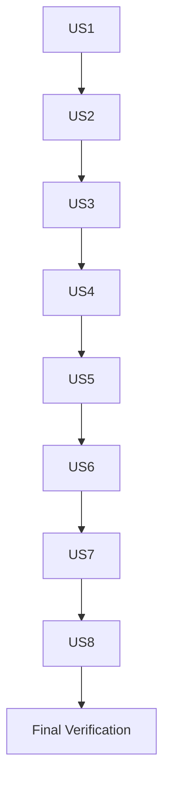

# Tasks: Codebase Remediation

**Feature Branch**: `009-codebase-remediation`
**Created**: 2026-07-30

---

## Phase 1: Setup

- [ ] T001 Ensure working on `009-codebase-remediation` branch with latest changes

## Phase 2: Foundational

- [ ] T002 Review all existing migration files to understand current schema state per `data-model.md`
- [ ] T003 Review all existing test files in `tests/Feature/Inventory/` to understand current patterns

## Phase 3: US1 — Fix Broken Migrations & Core Functionality (P0)

**Goal**: Fix the broken migration, add missing indexes, and secure local dev routes.

**Independent Test**: `php artisan migrate --pretend` shows `renameColumn`, index statements exist in the fix migration, `/mif` returns 403 from non-local IPs.

### Implementation

- [ ] T004 [US1] Fix `Schema::rename()` → `renameColumn('payed', 'paid')` in `database/migrations/2026_07_03_000002_fix_payed_to_paid.php`
- [ ] T005 [P] [US1] Add `->index()` on `itemable_type`, `itemable_id`, and composite `['itemable_type', 'itemable_id']` to `inventory_order_items` table in `database/migrations/2026_07_24_000001_fix_inventory_indexes_and_reference_id_type.php`
- [ ] T006 [P] [US1] Add `->index()` on `reference_type`, `reference_id`, and composite `['reference_type', 'reference_id']` to `inventory_transactions` table in `database/migrations/2026_07_24_000001_fix_inventory_indexes_and_reference_id_type.php`
- [ ] T007 [US1] Fix local routes guard in `routes/web.php` — use strict `===`, add IP whitelist `$request->ip() === '127.0.0.1'`

### Verification

- [ ] T008 [US1] Run `php artisan migrate --pretend` and confirm `renameColumn` shows for `payed`→`paid`
- [ ] T009 [US1] Run `php artisan migrate:fresh` and confirm zero errors

## Phase 4: US2 — Close Security Vulnerabilities (P1)

**Goal**: Fix ALL 12 security issues across LIKE escaping, authorization, env() calls, CORS, Telescope, Livewire, null school, fillable typo, backup, CSP, and sanitize middleware.

**Independent Test**: (1) LIKE queries escape `%`/`_`, (2) `pay()`/gard methods have `authorize()`, (3) no `env()` outside config, (4) CORS restricted, (5) Telescope disabled by default, (6) `getSchool()` null handled.

### Implementation

- [ ] T010 [P] [US2] Escape LIKE wildcards with `str_replace(['%', '_'], ['\\%', '\\_'], $search)` in `app/Http/Controllers/Inventory/InventoryItemController.php`
- [ ] T011 [P] [US2] Escape LIKE wildcards with `str_replace(['%', '_'], ['\\%', '\\_'], $search)` in `app/Http/Controllers/Inventory/InventoryOrderController.php`
- [ ] T012 [P] [US2] Escape LIKE wildcards with `str_replace(['%', '_'], ['\\%', '\\_'], $search)` in `app/Http/Controllers/Admin/ActivityLogController.php`
- [ ] T013 [P] [US2] Add `$this->authorize()` call to `InventoryOrderController::pay()`
- [ ] T014 [P] [US2] Add `$this->authorize()` call to `InventoryGardController::store()`
- [ ] T015 [P] [US2] Add `$this->authorize()` call to `InventoryGardController::update()`
- [ ] T016 [US2] Replace `env('MYSQL_OLD_DB')` with `config('database.connections.mysql_old.database')` in `app/Console/Commands/MigrateMysqlToPostgres.php`
- [ ] T017 [P] [US2] Add `mysql_old` connection config in `config/database.php`
- [ ] T018 [US2] Restrict `allowed_origins` from `['*']` to env-based origins in `config/cors.php`
- [ ] T019 [US2] Change `env('TELESCOPE_ENABLED', true)` to `env('TELESCOPE_ENABLED', false)` in `config/telescope.php`
- [ ] T020 [US2] Change `'release_token' => 'a'` to `env('APP_KEY')` in `config/livewire.php`
- [ ] T021 [US2] Add null `getSchool()` guard to `app/Http/Traits/SchoolTrait.php` — return `abort(403)` when school is null
- [ ] T022 [US2] Fix `'reiligon'` → `'religion'` in `$fillable` of `app/Models/User.php`
- [ ] T023 [US2] Sanitize backup filenames with `basename()` in `app/Http/Controllers/BackupController.php`
- [ ] T024 [US2] Create `app/Jobs/CreateBackupJob.php` and dispatch backup via queue instead of synchronous `Artisan::call()`
- [ ] T025 [US2] Update `BackupController` to dispatch `CreateBackupJob` instead of running `backup:run` synchronously
- [ ] T026 [US2] Fix CSP in `app/Http/Middleware/SecurityHeadersMiddleware.php` — remove `unsafe-eval`, add `connect-src`, `font-src`, `frame-src`
- [ ] T027 [US2] Add `->middleware('sanitize')` to inventory route groups in `routes/inventory.php`

### Verification

- [ ] T028 [US2] Run `php artisan test --compact --filter=InventoryItemTest` and confirm no regressions
- [ ] T029 [US2] Grep for `env(` outside config — confirm zero results

## Phase 5: US3 — Eliminate N+1 Queries & Performance Bottlenecks (P1)

**Goal**: Fix 4 performance issues — missing eager loads, unbounded dropdowns, and query-within-loop in GardService.

**Independent Test**: Inventory pages make ≤5 queries on paginated views. GardService fetches items via single `whereIn()`.

### Implementation

- [ ] T030 [US3] Add `->with(['student', 'user'])` to orders index query in `InventoryOrderController::index()`
- [ ] T031 [US3] Add `->with('classroom')` to items index query in `InventoryItemController::index()`
- [ ] T032 [US3] Add eager loads for `grade`, `classroom` in popup views in `app/Http/Controllers/ReportController.php`
- [ ] T033 [US3] Batch-fetch items before loop using `whereIn()` in `app/Services/Inventory/InventoryGardService.php::submitGard()`

### Verification

- [ ] T034 [US3] Run `php artisan test --compact --filter=InventoryOrderTest` and confirm query count assertions pass

## Phase 6: US4 — Ensure Data Integrity in Inventory Operations (P1)

**Goal**: Fix 5 data integrity issues — enum migration, dynamic Tailwind classes, Alpine index collision, conditional quantity fields, classroom select default.

**Independent Test**: Enum migration runs on MySQL 8+, dynamic status colors exist in production build, edit form saves all 5 items correctly, only relevant quantity field shows, classroom pre-selects correctly.

### Implementation

- [ ] T035 [US4] Rewrite enum fix migration in `database/migrations/2026_06_28_222252_fix_inventory_orders_enum_add_gard.php` to use `ALTER TABLE ... MODIFY COLUMN type ENUM(...)` for MySQL compatibility
- [ ] T036 [US4] Fix dynamic Tailwind classes in `resources/views/backend/inventory/orders/index.blade.php` — use `@php` block to compute full class string for status color
- [ ] T037 [US4] Rewrite `resources/views/backend/inventory/orders/edit_sarf.blade.php` — render ALL items (existing + new) through a single Alpine-managed `x-data` array to prevent index collision
- [ ] T038 [US4] Rewrite `resources/views/backend/inventory/orders/edit_tawreed.blade.php` — same Alpine-managed array approach
- [ ] T039 [US4] Fix `resources/views/backend/inventory/orders/_item_row.blade.php` — add `$orderType` parameter, conditionally show `quantity_in` or `quantity_out` with `x-show`
- [ ] T040 [US4] Fix classroom select default value in `resources/views/backend/inventory/items/_form.blade.php` — change `$item->id` to `$item->classroom_id`

### Verification

- [ ] T041 [US4] Run `npm run build` and confirm `text-success`/`text-warning` classes exist in production CSS
- [ ] T042 [US4] Run `php artisan test --compact --filter=InventoryOrderTest` and confirm no regressions

## Phase 7: US5 — Comprehensive Test Coverage for Inventory Module (P1)

**Goal**: Create 4 new test files and enhance existing test coverage for gard, transactions, authorization, and school-scoping.

**Independent Test**: All new test files pass.

### Implementation

- [ ] T043 [US5] Create shared test base class `tests/Feature/Inventory/InventoryTestCase.php` with school, user, and item setup methods
- [ ] T044 [P] [US5] Create `tests/Feature/Inventory/InventoryGardTest.php` covering gard create, store, edit, and update flows per FR-025
- [ ] T045 [P] [US5] Create `tests/Feature/Inventory/InventoryTransactionServiceTest.php` covering `stockIn`, `stockOut`, `adjustStock`, `canStockOut` per FR-026
- [ ] T046 [P] [US5] Add update, destroy, and pay toggle tests to `tests/Feature/Inventory/InventoryOrderTest.php` per FR-027, FR-028
- [ ] T047 [P] [US5] Create `tests/Feature/Inventory/InventoryAuthorizationTest.php` — verify 403 for unauthorized users on guarded endpoints per FR-029
- [ ] T048 [P] [US5] Create `tests/Feature/Inventory/InventorySchoolScopeTest.php` — verify cross-school data isolation per FR-030

### Verification

- [ ] T049 [US5] Run `php artisan test --compact --filter=InventoryGardTest` and confirm all pass
- [ ] T050 [US5] Run `php artisan test --compact --filter=InventoryTransactionService` and confirm all pass
- [ ] T051 [US5] Run `php artisan test --compact --filter=InventoryAuthorization` and confirm all pass
- [ ] T052 [US5] Run `php artisan test --compact --filter=InventorySchoolScope` and confirm all pass

## Phase 8: US6 — Improve Codebase Maintainability (P2)

**Goal**: Consolidate permissions, remove dead code, extract shared validation, fix PDF reports, register EmployeePolicy, fix controller naming.

**Independent Test**: Zero `stocks-*`/`clothes-*`/`books_sheets-*` permission references remain. `ClassRoom2.php` and unused services removed. PDF reports render with empty data.

### Implementation

- [ ] T053 [US6] Create permission rename migration in `database/migrations/XXXX_XX_XX_XXXXXX_rename_permissions.php` — map `stocks-*` → `inventory.items.*`, `clothes-*` → `inventory.orders.*`, `books_sheets-*` → `inventory.items.*`/`inventory.orders.*`
- [ ] T054 [P] [US6] Update permission references in all controllers — replace `stocks-*`, `clothes-*`, `books_sheets-*` with unified `inventory.*` names
- [ ] T055 [P] [US6] Update permission references in all policy classes
- [ ] T056 [P] [US6] Update permission references in all form requests
- [ ] T057 [P] [US6] Update permission references in `app/Helpers/PermissionsHelper.php`
- [ ] T058 [US6] Remove dead code file `app/Models/ClassRoom2.php`
- [ ] T059 [US6] Remove dead code file `app/Services/Reports/PDFExportService.php` (or merge into ReportService)
- [ ] T060 [US6] Create `app/Http/Requests/Inventory/BaseOrderRequest.php` with shared validation rules from StoreOrderRequest and UpdateOrderRequest
- [ ] T061 [P] [US6] Refactor `app/Http/Requests/Inventory/StoreOrderRequest.php` to extend `BaseOrderRequest`
- [ ] T062 [P] [US6] Refactor `app/Http/Requests/Inventory/UpdateOrderRequest.php` to extend `BaseOrderRequest`
- [ ] T063 [US6] Initialize `$order = ['total' => 0]` before `@forelse` in PDF report views (3 files) to prevent undefined variable errors on empty datasets
- [ ] T064 [US6] Replace `@foreach` with `@forelse` in views where empty states are missing — `orders/show.blade.php`, PDF views
- [ ] T065 [US6] Register `EmployeePolicy::class` in `app/Providers/AuthServiceProvider.php`
- [ ] T066 [US6] Fix inconsistent controller naming — `promotionController` → `PromotionController`, `fund_accountsController` → `FundAccountsController`, `schedulesController` → `SchedulesController`

### Verification

- [ ] T067 [US6] Run `php artisan test --compact` and confirm no regressions after permission changes
- [ ] T068 [US6] Grep for `stocks-*`, `clothes-*`, `books_sheets-*` — confirm zero references remain

## Phase 9: US7 — Standardize Routes & Configuration (P2)

**Goal**: Fix route conventions and hardcoded configuration values.

**Independent Test**: All route conventions follow REST. Config files use `env()` with defaults.

### Implementation

- [ ] T069 [US7] Move `/{type}` catch-all routes to the end of each route group in `routes/inventory.php`
- [ ] T070 [P] [US7] Convert all POST-based update routes to PUT across route files
- [ ] T071 [P] [US7] Convert snake_case URL segments to kebab-case across route files
- [ ] T072 [P] [US7] Add `->name()` to all API routes in `routes/api.php`
- [ ] T073 [P] [US7] Convert all GET-based destroy routes to DELETE across route files
- [ ] T074 [P] [US7] Add `throttle` middleware to specific inventory endpoints in `routes/inventory.php`
- [ ] T075 [US7] Change `'timezone' => 'EET'` to `env('APP_TIMEZONE', 'EET')` in `config/app.php`
- [ ] T076 [P] [US7] Change `'locale' => 'ar'` to `env('APP_LOCALE', 'ar')` in `config/app.php`
- [ ] T077 [US7] Create `config/school.php` with `currency` and `per_page` env-based defaults
- [ ] T078 [P] [US7] Replace hardcoded `'EGP'` with `config('school.currency')` across controllers
- [ ] T079 [P] [US7] Replace hardcoded `->paginate(10)` with `config('school.per_page')` across controllers
- [ ] T080 [P] [US7] Replace hardcoded `'/login'` with `route('login')` in template files
- [ ] T081 [P] [US7] Replace hardcoded Facebook URL with config or env variable in layout templates

### Verification

- [ ] T082 [US7] Run `php artisan route:list` and confirm all routes follow conventions (PUT not POST, DELETE not GET, kebab-case)
- [ ] T083 [US7] Run `php artisan test --compact` and confirm no regressions

## Phase 10: US8 — Polish Views & Fix Accessibility (P3)

**Goal**: Fix hardcoded strings, add accessible labels, fix checkAll() JS, add required attributes, remove dead code, deduplicate CSS.

**Independent Test**: All user-facing text uses `trans()`. Icon buttons have `aria-label` attributes. `checkAll()` toggles correctly.

### Implementation

- [ ] T084 [US8] Replace hardcoded `'Sheet'` with `trans('book_sheet.sheet')` in `resources/views/backend/inventory/items/index.blade.php`
- [ ] T085 [P] [US8] Replace hardcoded Arabic strings with `trans()` calls in layouts — `app.blade.php`, `header.blade.php`, `sidebar.blade.php`, `report_view.blade.php`
- [ ] T086 [P] [US8] Add `aria-label` attributes to icon buttons in `items/index.blade.php`, `_item_row.blade.php`, `items/show.blade.php`
- [ ] T087 [US8] Fix `checkAll()` JavaScript function in `resources/views/roles/create.blade.php` — ensure it correctly toggles all child checkboxes
- [ ] T088 [P] [US8] Add `required` attribute to student select elements in `create_sarf.blade.php` and `edit_sarf.blade.php`
- [ ] T089 [P] [US8] Remove commented-out code in `resources/views/layouts/app.blade.php`
- [ ] T090 [P] [US8] Deduplicate duplicate CSS definitions in `resources/views/layouts/header_css.blade.php`

### Verification

- [ ] T091 [US8] Run `php artisan test --compact` and confirm no regressions

## Phase 11: Final Verification

- [ ] T092 Run `vendor/bin/pint --format agent` and confirm zero formatting issues
- [ ] T093 Run `php artisan test --compact` and confirm all tests pass (zero regressions)
- [ ] T094 Run `php artisan route:list` and verify inventory routes follow REST conventions
- [ ] T095 Commit all changes to `009-codebase-remediation` branch

---

## Dependencies

## Parallel Execution Opportunities

Within each phase, tasks marked `[P]` can run in parallel. Across phases, US2 (security) and US3 (performance) touch different files — can run in parallel if needed. US6 (maintainability), US7 (routes), and US8 (views) also have no file overlap.

## MVP Scope

Phase 3 (US1 — broken migrations) is the minimum viable deliverable. Without it, `php artisan migrate` fails and blocks all other work.

## Independent Test Criteria Per Story

| Story | Test Command |
|-------|-------------|
| US1 | `php artisan migrate --pretend` + 403 check on `/mif` |
| US2 | Code review + grep for env() outside config |
| US3 | Query count assertions in InventoryOrderTest |
| US4 | `npm run build` + form submission tests |
| US5 | All 4 new test files pass |
| US6 | Zero legacy permission references remain |
| US7 | `php artisan route:list` follows conventions |
| US8 | Visual inspection for trans() and aria-label |
